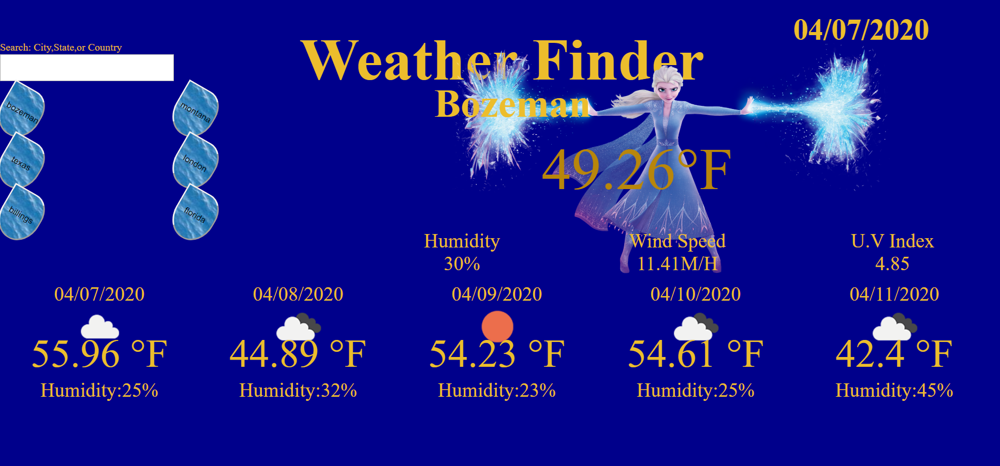

first off and foremost I must support the artists who shared their work to enhance my own..
first off is the Main api,which acts like the engine for this site.

Openweathermaps.org

the following was source through https://www.deviantart.com/

water texture for "rain drop" buttons
BY
SimplyBackgrounds

Elsa "Frozen fan art" (weather icon)

the following sourced through https://favpng.com/

midna,zelda clouds,dark link "zelda fan art" (weather Icon)
user dpap

Misty "Pokeman Fan Art" (weather Icon)
User KookieMonster143

Juvia lockart "fairytail fan art" (weather icon)
user Prospectivedoctor's

Korra "Avatar:The legend of Korra fan art"

misc. sites

Solaire of Astora aka Sunbro "Dark Souls fan art" (weather icon)
https://vsdebating.fandom.com/wiki/Solaire_of_Astora
by Mr. Bambu

Thor "Marvel Comics Fan Art" (weather icon)
https://pngriver.com/download-thor-png-picture-101766/
by Unknown(so sad bro, get some recognition)

Thank you soo much for keeping the art flowing through multiply platforms and collaborated effort!!!!

Description: A simple weaather app. Type in a city,state, and/or country get cureent weather and the forcast for the next 5 days using the openweathermap api.

